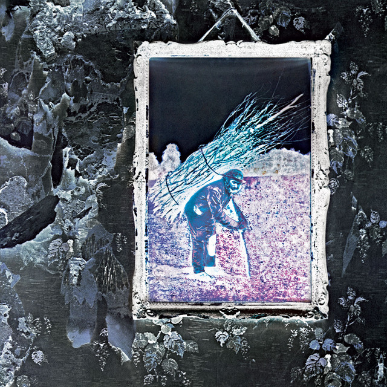

# 🎵 Neon Beats - Premium Music Store & Player

A beautiful, modern music player and store built with vanilla HTML, CSS, and JavaScript. Features a stunning dark theme with glassmorphism effects, audio visualization, and a complete shopping experience.



## ✨ Features

- 🎵 **Music Player** - Play, pause, skip, shuffle, and repeat
- 🎨 **Expanded Player** - Full-screen player with circular progress ring and volume controls
- ⌨️ **Keyboard Shortcuts** - Complete keyboard control (Space, Arrows, M, S, R)
- 📥 **Download & Share** - Download tracks and share via Web Share API
- 🎛️ **Settings Menu** - Audio quality, crossfade, and volume normalization
- 🔄 **Audio Fallback** - Automatic fallback to sample audio when files are missing
- 📝 **Comprehensive Documentation** - Fully commented codebase for easy understanding
- 🔍 **Search & Filter** - Find songs by title, artist, or album
- 📁 **Local Music Import** - Add your own music files with thumbnail support
- 🎧 **Audio Visualizer** - Real-time frequency visualization
- 🛍️ **Music Store** - Browse and purchase music gear
- 🛒 **Shopping Cart** - Complete checkout experience
- 💾 **Offline Ready** - Works mostly offline after first load
- 🌙 **Dark Theme** - Beautiful glassmorphism design

## 🚀 Quick Start

### Option 1: One-Click Launch (Easiest)
1. **Double-click** `START_SERVER.bat`
2. Browser will open automatically at `http://localhost:8000`
3. Enjoy! 🎵

### Option 2: Command Line
```bash
# Start the server
python server.py

# Open browser to:
# http://localhost:8000
```

### Option 3: Direct File (Limited Features)
- Open `index.html` directly in your browser
- ⚠️ Note: Audio playback won't work due to browser security (CORS)

## 📁 Project Structure

```
Music Player/
├── index.html          # Main HTML file
├── script.js           # JavaScript (music player logic)
├── styles.css          # Styles (glassmorphism theme)
├── server.py           # Local HTTP server (Python)
├── START_SERVER.bat    # Easy launcher for Windows
├── README.md           # This file
├── docs/               # Documentation files
│   ├── USER_GUIDE.md   # User manual
│   ├── ARCHITECTURE.md # Technical architecture
│   └── FEATURES.md     # Detailed feature list
└── assets/
    ├── images/         # Album covers and product images
    └── audio/          # Music files
```

## 🎮 How to Use

### Playing Music
1. **Browse Library** - Scroll to see all available songs
2. **Click a Song** - Click any song card to load it
3. **Press Play** - Click the ▶️ button in the bottom player
4. **Use Controls** - Next, Previous, Shuffle, Repeat buttons available

### Expanded Player
- **Click Album Art** in the bottom player to open full-screen mode
- Features: Circular progress ring, clickable progress bar, volume controls, visualizer
- **Settings**: Click gear icon for audio quality, crossfade, and normalize options
- **Click Minimize** (top-left) to return to normal view

### Adding Local Music
1. Click **"Import Local Music"** in the library section
2. Select audio files from your computer
3. Songs will be added to your library
4. **Tip:** Add image files (cover.jpg) in the same folder for thumbnails

### Shopping in the Store
1. Navigate to **Store** section
2. **Click Product Cards** to view details
3. **Add to Cart** using the cart button
4. **Checkout** when ready to purchase

### Keyboard Shortcuts

| Key | Action |
|-----|--------|
| **Space** | Play/Pause |
| **→** | Next song |
| **←** | Previous song |
| **↑** | Volume up |
| **↓** | Volume down |
| **M** | Mute/Unmute |
| **S** | Shuffle toggle |
| **R** | Repeat cycle (off → all → one) |

## 🛠️ Technical Details

### Frontend Stack
- **HTML5** - Semantic markup
- **CSS3** - Custom properties, glassmorphism, animations
- **Vanilla JavaScript** - No frameworks, pure ES6+

### Backend
- **Python 3** - Simple HTTP server with CORS support
- **Port 8000** - Default server port

### Browser Support
- Chrome/Edge (recommended)
- Firefox
- Safari (limited audio context support)

## 📝 Development

### Requirements
- Python 3.x (for local server)
- Modern web browser

### Making Changes
1. Edit `script.js` for functionality
2. Edit `styles.css` for styling
3. Edit `index.html` for structure
4. Refresh browser to see changes (Ctrl+Shift+R for hard refresh)

### Adding Real Audio
Currently using demo audio (data URLs). To add real music:

1. Create folder: `assets/audio/`
2. Add MP3 files to this folder
3. Update `script.js` song sources:
   ```javascript
   sources: ["assets/audio/your-song.mp3"]
   ```

## 🎨 Features in Detail

### Audio Visualizer
- Uses Web Audio API for real-time visualization
- Frequency bars respond to music playback
- Toggle on/off from player controls

### Glassmorphism UI
- Backdrop blur effects
- Translucent panels
- Neon accent colors
- Smooth animations throughout

### Local Storage
- Remembers your favorites
- Saves shopping cart
- Persists volume settings

## 🐛 Troubleshooting

### Server Won't Start
- **Error**: "Port 8000 already in use"
- **Fix**: Close other instances or change port in `server.py`

### Loading Overlay Stuck
- **Fix**: Wait 5 seconds or press Ctrl+Shift+R to hard refresh

### Audio Won't Play
- **Fix**: Make sure you're using the local server (not file://)
- Check browser console (F12) for errors

### Images Not Loading
- **Fix**: Verify `assets/images/` folder exists
- Check that image files are present

## 📜 License

This project is open source and available for personal and educational use.

## 🙏 Credits

- **Icons**: RemixIcon
- **Fonts**: System fonts for fast loading
- **Design**: Custom glassmorphism theme

## 📧 Support

For issues or questions:
1. Check browser console (F12) for errors
2. Verify server is running on port 8000  
3. Try hard refresh (Ctrl+Shift+R)

---

**Made with ❤️ and lots of ☕**

Enjoy the music! 🎵
